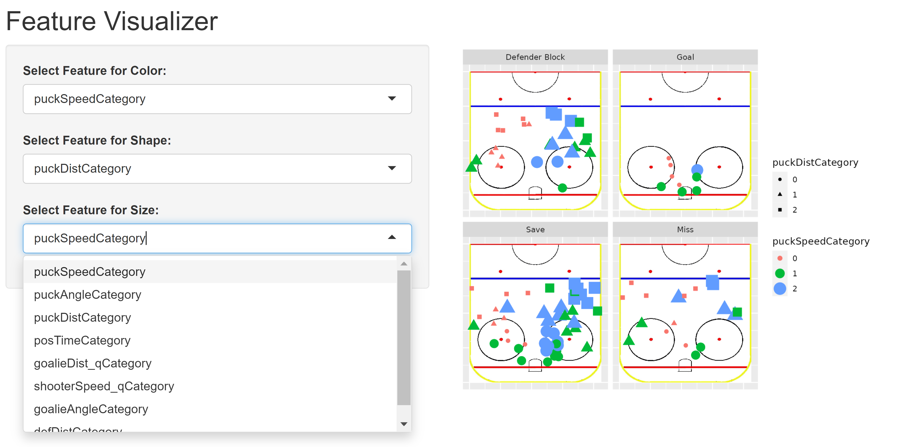

## Weekly Work Summary	

**NOTE:** Follow an outline format; use bullets to express individual points. 

* RCS ID: enyena
* Project Name: Hockey Analytics 
* Summary of work since last week 

    * I continued to work on visualization of rink and the players and started working on a Shiny App. 

* Summary of github issues added and worked 

    * N/A
    
* Summary of github commits 

    * branch name: dar-enyena

* List of presentations,  papers, or other outputs

    * https://docs.google.com/presentation/d/1gVbmJfGP740rKsaUjJ_-tK1Xc91iKHDzh8Pw_10sSag/edit#slide=id.gb75c90f927_0_22
    * https://docs.google.com/presentation/d/1vGuPcIwtIdDTHjiG827IqSUXTbSe23ecM2W561OV7Cc/edit?usp=sharing
    * https://rpiexchange-my.sharepoint.com/:p:/g/personal/woodsa4_rpi_edu/EemlSIdYQEJNk1UFWtV1IDQBULW-tZKZ0eBZFWhg6tXOAQ?rtime=YkfxXuLl20g
    
* List of references (if necessary) 
* Indicate any use of group shared code base
* Indicate which parts of your described work were done by you or as part of joint efforts
    * I started with code that was originally written by Mohamed (rink plot). This week, I continued to work with the data frame created by Jeff. I also used Liebin's app as the base for my shiny app. 

* **Required:** Provide illustrating figures and/or tables

## Personal Contribution	

* Clearly defined, unique contribution(s) done by you: code, ideas, writing...
* Include github issues you've addressed

  * I have been the main contributor to the development of the rink plot displays. I have used features added by Caleb and Jeff, but I created the images. I am the only one working on the rink plot app. 

```{r setup_1, echo = FALSE, eval=FALSE}
# Install required packages
r = getOption("repos")
r["CRAN"] = "http://cran.rstudio.com"
options(repos = r)

if (!require("jpeg")) {
   install.packages("jpeg")
}
if (!require("grid")) {
   install.packages("grid")
}
if (!require("scales")) {
   install.packages("scales")
}
if (!require("reshape2")) {
   install.packages("reshape2")
}
if (!require("tidyverse")) {
   install.packages("tidyverse")
}
if (!require("tidymodels")) {
   install.packages("tidymodels")
}
if (!require("ggnewscale")) {
   install.packages("ggnewscale")
}
if (!require("glmnet")) {
   install.packages("glmnet")
}
if (!require("MLmetrics")) {
   install.packages("MLmetrics")
}
if (!require("knitr")) {
   install.packages("knitr")
}
if (!require("knitr")) {
   install.packages("knitr")
}
if (!require("magrittr")) {
   install.packages("magrittr")
}

install.packages('RColorBrewer')
```

```{r setup_2, include = FALSE}
# Load required R packages
# NOTE: Run this chunk every time but don't include code or results in rendered notebook

# Plotting
library(jpeg)
library(grid)
library(ggnewscale)
library(scales)
# Goal shot stats
library(reshape2)
#library(randomForest)
# library(glmnet)
#library(MASS)
#library(Boruta)
#library(MLmetrics)
#library(kernelshap)
#library(shapviz)

library(knitr)
library(tidyverse)
library(tidymodels)
library(magrittr)

library(RColorBrewer)

# All user-defined functions are contained in the following helper script file. 
source("../../AnalysisCodeFunc.R")
```

## Analysis: Question 1 - Does a Continuous Color Scale Look Better Than the Discrete Scale?

### Question being asked 

_Provide in natural language a statement of what question you're trying to answer_

How well does a continuous color scale represent the data numerical data compared to a three level categorized scale?

### Data Preparation

_Provide in natural language a description of the data you are using for this analysis_

_Include a step-by-step description of how you prepare your data for analysis_

_If you're re-using dataframes prepared in another section, simply re-state what data you're using_

The data frame that Jeff made contains both the continuous and categorized variables. I will use it going forward as I use both types of features for this notebook. Because I am displaying the rink, I included the appropriate numbers for the rink size and coordinates and loaded in the jpegs. Aside from loading the data frame in, the categorized features were changed to factors from numerical for graphing purposes. 

```{r, result01_data}

# Size of rink image and of all plots
xsize <- 2000
ysize <- 850

# FPS of the video
fps <- 29.97

# Coordinates to the goal pipes
pipes_x <- 1890
lpipe_y <- 395
rpipe_y <- 455

# read in the data frame
shots_stats_cat <- readRDS("../../StudentData/categorized_shots_stats_goal.df.Rds")

# This file path should contain the hockey rink images and all the sequences
filepath <- '../../FinalGoalShots/'

# Read the rink images and format them to a raster used for graphing
rink_raster <- makeRaster(filepath, 'Rink_Template.jpeg')
half_rink_raster <- makeRaster(filepath, 'Half_Rink_Template.jpeg')

```

### Analysis: Methods and results

_Describe in natural language a statement of the analysis you're trying to do_

_Provide clearly commented analysis code; include code for tables and figures!_

The previous/first image I made, shown below, was made with puck speed discretized. Before this, I had not displayed that feature in any other way. Naturally, I wanted to find the better visual so to exhaust another option, I tried creating a continuous color scale to see how it compares.

```{r, result01_analysis}

# everything needs to be factored rather than numeric for imaging
shots_stats_cat$puckSpeedCategory <- shots_stats_cat$puckSpeedCategory %>% as.factor()
shots_stats_cat$rightHanded <- shots_stats_cat$rightHanded %>% as.factor()
shots_stats_cat$posTimeCategory <- shots_stats_cat$posTimeCategory %>% as.factor()

# The original image with puck speed categorized 
halfRinkGraph(shots_stats_cat) + 
  # Graph players colored by puck speed with handedness labeled by shape
  geom_point(aes(color = puckSpeedCategory, x = shotStatX(shots_stats_cat), 
    y = shotStatY(shots_stats_cat), shape = rightHanded)) +
    scale_color_discrete('Speed Level', type = c('green','orange','red'), labels =
    c('Fastest', 'Middle', 'Slowest')) +
    scale_shape(labels = c('Left', 'Right')) + facet_wrap(~shotOutcome) +
    labs(shape = 'Handedness')


# creating a continuous color scale for the puck speeds
myPalette <- colorRampPalette(rev(brewer.pal(3, "YlGnBu")))
colorscale <- scale_color_gradientn(colours = myPalette(100), limits=c(0, 100))

# The new image with a continuous color scale representing speed
halfRinkGraph(shots_stats_cat) + 
  # players colored by puck speed with position time as size, grouped by outcome
  geom_point(aes(color = puckSpeed, x = shotStatX(shots_stats_cat),
    y = shotStatY(shots_stats_cat), size = posTimeCategory, size = 3)) +
    scale_size_discrete(labels = c('Short', 'Middle', 'Long')) +
    facet_wrap(~shotOutcome) + colorscale +
    labs(color = 'Puck Speed (ft/sec)', size = 'Possession Time', size = NULL)
    
```


### Discussion of results

_Provide in natural language a clear discussion of your observations._

When presented to the group, the continuous color scale was deemed inferior to the discrete scale. The discrete color scale is much more clear cut as to how fast or slow the puck was moving. Once the categorization of the levels are adjusted by Jeff, I think it will provide a stronger representation of the data. 

## Analysis: Question 2 - Shape vs. Size: Optimizing Feature Display

### Question being asked 

_Provide in natural language a statement of what question you're trying to answer_

Does the size or shape of the feature create a more clear rink image?

### Data Preparation

_Provide in natural language a description of the data you are using for this analysis_

_Include a step-by-step description of how you prepare your data for analysis_

_If you're re-using dataframes prepared in another section, simply re-state what data you're using_

Any needed data or numbers has already been loaded in. I am using the same data frame edited by Jeff. 

```{r, result02_data}

# N/A

```

### Analysis: Methods and Results  

_Describe in natural language a statement of the analysis you're trying to do_

_Provide clearly commented analysis code; include code for tables and figures!_

Now that I have become very familiar with creating rink images, I have found more ways to display more and more features on the same display. Dr. Bennett provided some ideas during our stand up and I want to experiment with shapes and sizes of the dot plot. My goal is to create several images and allow the team to give their input and try to determine what is the best pattern of displays. I also wanted to try to visualize new features I had yet to utilize. 

All images are still grouped by outcomes but vary with what feature is represented by shape and/or color and/or size. The first plot uses the categorized puck speed as color and the categorized possession time as size. The second plot uses the categorized puck speed as color and the categorized possession time as shape. I wanted to compare the two and allow the group to provide their input as to what was the better image and by what metrics. The last image was me exploring other features. It has categorized puck distance as color and the categorized possession time as shape. 

```{r, result02_analysis, fig.dim = c(5, 4.25)}

# Graph players colored by speed level with size as possession time
halfRinkGraph(shots_stats_cat) + 
  geom_point(aes(color = puckSpeedCategory, x = shotStatX(shots_stats_cat), y = 
    shotStatY(shots_stats_cat), size = posTimeCategory)) +
    scale_color_discrete('Speed Level', type = c('green','orange','red'), labels =
    c('Fastest', 'Middle', 'Slowest')) + scale_size_discrete('Possession Time', 
    labels = c('Short', 'Medium', 'Long')) + facet_wrap(~shotOutcome) + 
    labs(color = 'Puck Speed (ft/sec)', size = 'Possession Time')


# everything needs to be factored rather than numeric for imaging
shots_stats_cat$puckSpeedCategory <- shots_stats_cat$puckSpeedCategory %>% as.factor()
shots_stats_cat$posTimeCategory <- shots_stats_cat$posTimeCategory %>% as.factor()

# Graph players colored by speed level with shape as possession time
halfRinkGraph(shots_stats_cat) + 
  geom_point(aes(color = puckSpeedCategory, x = shotStatX(shots_stats_cat), y =
    shotStatY(shots_stats_cat), shape = posTimeCategory, size = 3)) +
    scale_color_discrete('Speed Level', type = c('green','orange','red'), labels =
    c('Fastest', 'Middle', 'Slowest')) +
    scale_shape_manual('Possession Time', values = c(49, 50, 51), labels = c('Short',
    'Medium', 'Long')) + facet_wrap(~shotOutcome) +
    labs(color = 'Puck Speed (ft/sec)', shape = 'Possession Time', size = NULL)


# everything needs to be factored rather than numeric for imaging
shots_stats_cat$puckDistCategory <- shots_stats_cat$puckDistCategory %>% as.factor()

# Graph players colored by puck distance with size as possession time
halfRinkGraph(shots_stats_cat) + 
  geom_point(aes(color = puckDistCategory, x = shotStatX(shots_stats_cat), y =
    shotStatY(shots_stats_cat), shape = posTimeCategory, size = 3)) +
    scale_color_discrete('Puck Distance', type = c('green','orange','red'), labels =
    c('Close', 'Middle', 'Far')) + scale_shape_manual('Possession Time', values =
    c(49, 50, 51), labels = c('Short', 'Medium', 'Long')) + facet_wrap(~shotOutcome) 

```

### Discussion of results

_Provide in natural language a clear discussion of your observations._

The first two rink plots use the same variable for color. One represents possession time as size while the other is represented as a number. Personally, I did not think shape was the best due to the overlap of the dots. When presented to the group, there were varying opinions on which is the better display. Because I was getting various opinions, this is where the idea of the app became stronger. How do we determine what is the "better" display and what is the reasoning behind that. This idea is further explained in question 3.

The third plot made me quickly realize that some features do not need to be considered for the feature selection. When looking at the plots, you can see the gradient from red to green as you get closer to the goal. This is expected because the distance of the puck is represented by color. Red representing the further shots and green the closest. These rink plots have the distance built into the image as the "dots", in this case numbers, are plotted based on the puck's coordinates. It is more useful to select features to highlight that are not naturally revealed in the plot. Despite this not adding any new information, it did serve as a sanity check as puck distance was represented accurately. 


## Analysis: Question 3 - Shiny App Development

### Question being asked 

_Provide in natural language a statement of what question you're trying to answer_

How can I turn the previously created images into a functional app?

### Data Preparation

_Provide in natural language a description of the data you are using for this analysis_

_Include a step-by-step description of how you prepare your data for analysis_

_If you're re-using dataframes prepared in another section, simply re-state what data you're using_

I will be using the same data frame and rink imaging parts used prior. I also used Liebin's app as the base for mine.  

```{r, result03_data}

#N/A

```

### Analysis methods used  

_Describe in natural language a statement of the analysis you're trying to do_

_Provide clearly commented analysis code; include code for tables and figures!_

Throughout the development of all these images, I learned that, generally, what conclusions you get out of the images is up to individual interpretation. What are the best displays come down to individual preference. As mentioned in question two, some may prefer possession time as shape and others as size. Additionally, with the ability to easily swap out what feature is represented by color, shape, or size, there are LOTS of combinations that can be created. Creating an app that can automatically develop any combination of features, displaying up to three, could be useful. I am not a hockey player or coach nor someone that has hockey expertise. At times, my group would give varying opinions on what is the best way to display what feature. Rather than trying to find the best display for the plots, I find it will be more helpful to make a tool that those with expertise can manipulate, set up the features how they please, and make their own conclusions. 

* Link to the app: https://lp01.idea.rpi.edu/shiny/enyena/HockeyApp/

```{r, result03_analysis, out.width = "90%", fig.align = "center"}

# The link to the app is above 

# The code for the app is found under ShinyApps/RinkPlots in the GitHub
# Unfortunately, the link is not working but the app is functional in RStudio

# To display a screenshot from the app as my link is not functional yet
 

```


### Discussion of results

_Provide in natural language a clear discussion of your observations._

The app is at its beginning stages. As shown in the image above, the app allows users to select a feature from a drop down list. There are three selection boxes. The first box displays a selected feature sorted by color. The second box displays a selected feature as shape. The last displays a selected feature as size. All displays are still grouped by the four possible outcomes: Defender Block, Goal, Miss, and Save. The app updates the rink displays as different features are selected. It is working as intended but needs some improvements.

There is not too much to takeaway as the app is straightforward. Allowing users to manipulate the feature representation will allow them to create their own version of displays and determine what looks best to them. Additionally, this can be used as a tool for those with hockey knowledge to look for or visually analyze trends. This removes error from my end as I do not produce any conclusions as it is left to the user. 

## Summary and next steps

_Provide in natural language a clear summary and your proposed next steps._

Going forward, my sole contributions will be app development. I need to figure out a better name for the app as this was serving more as a placeholder and is not the best descriptor. Also, I need to create better feature labels and add labels that change with the selection of different features.

Despite the group thinking discrete is the better option, it might be a nice to touch to give the app user the option to create discrete or continuous scales. 