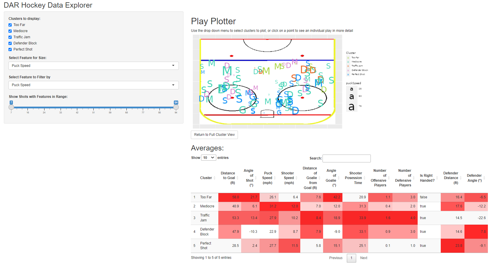
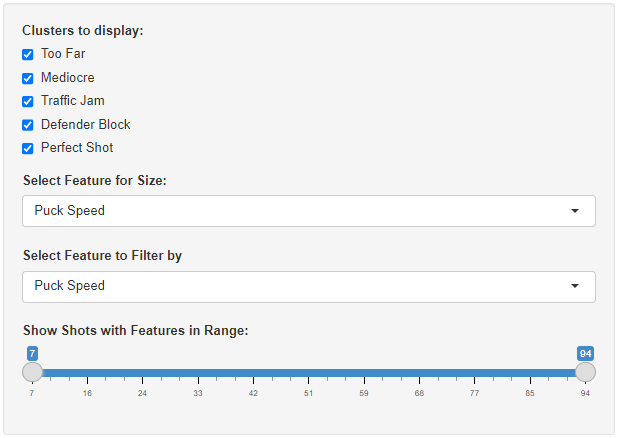
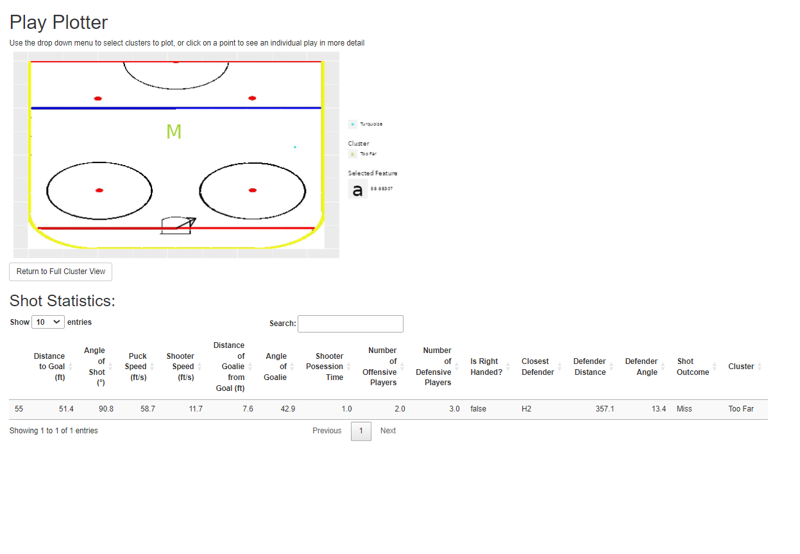

<!-- Replace 'title' with your title -->
<!-- Replace 'author' with your author list -->
<!-- Replace 'date' with with the current date -->

<!-- For R Markdown help see: http://bit.ly/RMarkdownCheatSheet -->
<!-- For R Notebook specific help see: http://bit.ly/2uNDpfA -->

<!-- Copy this notebook template to your working directory and customize -->

# DAR Project and Group Members

* Project name: Hockey Analytics
* Project team members: Caleb Smith, Amy Enyenihi, Ashley Woodson, Lieben Zhang, Jeff Jung

# Instructions (DELETE BEFORE SUBMISSION)

* Consider the document your are creating to be a _research paper_ with embedded code or, if this is not possible, links to where the embedded code can be found.   
* This document should "read" like a standalone scientific report written in complete sentences (i.e. not bullets) using good rules of grammar. It should be readable as a paper even if all the code is not shown, and if only the results of running you code are shown.  
* The document should be written for someone who is not already familiar with the project. As such you will need to describe the basics of the problem. You need to describe the basics of the data.  You should have sufficient details for scientific reproducibility including documentation of the code. You will need to describe the analysis methods that can be used together with the code to reproduce your work.  This is especially important if you use several R files. _Ideally someone should be able to go back years later and understand exactly what you did and reproduce your results._
* A suggested report structure is given below, but you can customize this to meet the needs of your project. You must make sure the elements below -- data description, problems tackled, methods, results, discussion, and future work -- are addressed even if you change the organization. If you tackled multiple separate projects fell free to create a section for each problem and then separately discuss the data, problems tackled, methods, results and discussion. Make sure to provide a final summary and future work at the end.  
* **ProTip: Create dataframes once:** If you have code chunks with long run times that create data frames, you can execute them once, and save them to an Rds.  Comment out that code for subsequent runs or indicate in the code chunk header that the code should not execute; simply read in the Rds when knitting your notebook. 
* If you have other documents that are part of your submission then put them on github and link to them from this document. You can provide excerpts or screen shots of the external files and reference the longer version.

## More thoughts on your notebook submission

* Every student's final project notebook should be written individually or, in some cases, as a small group. You must discuss with the instructor if you think you should do a small group notebook; otherwise assume you're creating an individual until approved.  
* As noted above, your final notebook serves as a written presentation of your work this semester so it must be written like a research paper.  You should use proper R Markdown code chunk syntax to hide code chunks that don't need to be shown. **Most of your code does not need to be visible in your final knitted report!**
* The R code that executes the results should be embedded in this notebook if possible. 
    + It's also okay to "source" external scripts from within your notebook, including those provided by your instructors.
    + PLEASE make sure all source code is in your team's github repository!
* Fall 2023 students may have work that is not appropriate to be embedded on your final notebook
    + You should describe the work in the notebook and provide figures generated elsewhere (e.g. screen shots, graphs). 
    + Indicate if that work has been committed to github. If necessary put details in Appendix including the names of the committed files.    
* Your writing style should be suitable for sharing with external partners/mentors and useful to future contributors. Do not assume that your reader is familiar with the problem. Again, write as if this is a research paper. 
* Focus on results; please don't summarize everything you did this semester!
    + Discuss only the *most important* aspects of your work. 
    + Ask yourself *what really matters?*
* **IMPORTANT:** Discuss any insights you found regarding your research. 
* If there are limitations to your work, discuss, in detail. 
* Include any **background** or **supporting evidence** for your work. 
    + For example, mention any relevant research articles you found -- and be sure to include references!
* Include your recommendations for continuing or extending your project
    + Data utilization...
    + Analytics...
    + Visualizations
    + User interface design...
    + Apps...
    + Open questions that could be investigated...
    
## NOTEBOOK SUBMISSION CHECKLIST: Things to check before you submit (DELETE BEFORE SUBMITTING) ##

* Have you given your file(s) a clear, sensible name? 
    + `my_notebook.Rmd` or `joey.Rmd` are **not* acceptable!
* Is your document readable as a research paper even if all the code is suppressed? 
    + Try suppressing all the code using hint below and see if this is true.
* Did you proofread your document? Does it use complete sentences and good grammar?
* Is every figure clearly labeled and titled? 
* Does every figure serve a purpose? 
     + Does the figure have a useful title? **Hint:** What _question_ does the figure answer? 
     + You can put extra (non-essential) figures in your **Appendix**.
     + Is the figured captioned?
     + Are the figure and its associated findings discussed in the text? 
     + Is it clear which figure is being discussed? **Hint:** use captions!
* Are your tables clearly labeled and legible?
     + We recommend using `kable()` (built into `knitr`) or the `gt` ("Grammar of Tables") package
     + `xtable()` might also work for you (not as easy as `kable()` and not as elegant as `gt`) 
     + Is the table and what its associated findings discussed in the text? 
     + Is the table titled and captioned?
     + Are the table and its associated findings discussed in the text? 
     + Is it clear which figure is being discussed (hint use the captions)?
* **CRITICAL:** Have you given enough information for someone to reproduce, understand and extend your results?
     + Where can they *find* the data that you used?
     + Have you *described* the data that used?
     + Have you *documented* your code? 
     + Are your figures *clearly labeled*?
     + Did you *discuss your findings*?
     + Did you use good grammar and *proofread* your results?
     + Finally, have you *committed* your work to github and made a *pull request*?
     + Did you indicate the github *issues* that you addressed? 


* Use this notebook is a template for your FINAL project notebook. 
* Use the sections starting with **Work Summary** as your outline for your submitted notebook.
* Summarize ALL of your work that is worthy of being preserved in this notebook; Feel free to include work in the appendix at end.   It will not be judged as being part of the research paper but rather as additional information to be preserved.  **if you don't show and/or link to your work here, it doesn't exist for us!**

## Instructions: Submitting a Notebook via github (DELETE BEFORE SUBMISSION)

1. Create a new copy of this notebook in the appropriate assignment sub-directory of your team's github repository using the following naming convention

   * `dar_final_rcsid_ddmmmyyyy.Rmd` and `dar_final_rcsid_ddmmmyyyy.html`
   * For example, `dar_final_erickj4_1nov2021.Rmd`
   * Look for `FinalProject` under `StudentNotebooks` 
   
2. Delete the "INSTRUCTIONS" section!!

3. You **MUST** include figures and/or tables to illustrate your work. *Screen shots are okay*; exported PNGs are preferred.

4. You **MUST** include links to other important resources (knitted HTMl files, Shiny apps). See the guide below for help.

5. Commit the source (`.Rmd`), pdf (`.pdf`) and knitted (`.html`) versions of your notebook and push to github. Turn in the pdf version to lms. 

6. **Submit a pull request.** Please notify Dr. Erickson if you don't see your notebook merged within one day. 

7. **DO NOT MERGE YOUR PULL REQUESTS YOURSELF!!**

See LMS for guidance on how the contents of this notebook will be graded.

**DELETE THE SECTIONS ABOVE!**

# Notebook User Guide  (DELETE BEFORE SUBMISSION)

*R Notebooks are meant to be dynamic documents. Provide any relevant technical guidance for users of your notebook. Also take care of any preliminaries, such as required packages. Sample text:*

This report is generated from an R Markdown file that includes all the R code necessary to produce the results described and embedded in the report.  Code blocks can be surpressed from output for readability using the command code `{R,  echo=show}` in the code block header. If `show <- FALSE` the code block will be surpressed; if `show <- TRUE` then the code will be show. 

```{r}
# Set to TRUE to expand R code blocks; set to FALSE to collapse R code blocks 
show <- TRUE
```

<!-- Expand this list as necessary for your notebook -->
Executing this R notebook requires some subset of the following packages:

* `ggplot2`
* `tidyverse`
* `knitr`
* `mltools`
* `umap`
* `data.table`
* `gplots`
* `tidymodels`
* `xgboost`
* `pROC`
* *List other packages...*

These will be installed and loaded as necessary (code suppressed). 

<!-- The `include=FALSE` option prevents your code from being shown at all -->
```{r, include=FALSE}
# This code will install required packages if they are not already installed
# ALWAYS INSTALL YOUR PACKAGES LIKE THIS!

if (!require("viridis")) {
   install.packages("viridis")
   library(viridis)
}

if (!require("ggplot2")) {
   install.packages("ggplot2")
   library(ggplot2)
}
if (!require("tidyverse")) {
   install.packages("tidyverse")
   library(tidyverse)
}
if (!require("knitr")) {
   install.packages("knitr")
   library(knitr)
}
if (!require("mltools")) {
   install.packages("mltools")
   library(knitr)
}
if (!require("umap")) {
   install.packages("umap")
   library(umap)
}
if (!require("data.table")) {
   install.packages("data.table")
   library(data.table)
}
if (!require("gplots")) {
   install.packages("gplots")
   library(gplots)
}
if (!require("kableExtra")) {
   install.packages("kableExtra")
   library(kableExtra)
}
if(!require(tidyverse)){
  install.packages("tidyverse")
  library(tidyverse)
}
if(!require(tidymodels)){
  install.packages("tidymodels")
  library(tidymodels)
}
if(!require(xgboost)){
  install.packages(xgboost)
  library(xgboost)
}
if(!require(pROC)){
  install.packages(pROC)
  library(pROC)
}
## Repeat as needed for your required packages
#if (!require("example")) {
#   install.packages("example")
#   library(example)
#

```

# Abstract
*Briefly* summarize your project and findings. A good rule of thumb is to write your abstract *after* you've prepared most of the notebook. 

The primary goal of the project was to provide the RPI Women's hockey team with actionable insights based on data captured about shots on a goal. This was achieved by using prediction models to analyze feature importance as well as clustering to type shots. I found that the most important factor in whether a shot was a goal was the distance to the goal, followed by the number of players involved. To allow the team to get further insight from the data using their domain expertise, I developed an interactive R Shiny app that plots plays on the rink and allows the user to subset the data.


# Introduction and Background
Frame your project, including any relevant background that argues for the significance of the work, previous approaches taken by others, and motivation for the approach taken by you and your team.
Note the goal of this document is to create a research paper that documents your primary research and either includes the code.  

The primary goal of this project was to provide useful insights to the RPI Women's hockey team. There is relatively little (public) data analytics going on within college hockey beyond basic statistics for players and teams, so we had relatively little to work with from previous work. We were very fortunate to have access the the work of the summer URP team, who placed a camera on the President's box at the Houston Field House to capture footage of the game. Due to limitations in capture footage (and for simplicity) the data we were provided is primarily for the RPI side of the rink, we focused primarily on determining how the team could get scored on less, and hopefully use that to provide insights on how they could score more goals, as that tends to be an important part of winning hockey games.


```{r }
# Code 

```

# Problems Tackled
Discuss the goals of your work and the questions you addressed. 
Describe how the rest of your final project report is organized.  

The primary goal of the work was to determine different modes of failure for a shot on a goal. This was the initial goal of the project, which lead to the secondary goal of how to best present our findings to the hockey team in a way that would allow them to understand it, apply the results, and make further findings that we might not be able to see because of our lack of domain knowledge.

The rest of the report is organized roughly according to the provided template. Data description provides a description of what each feature actually means, including units. Data Analytics Methods goes over the feature selection and clustering methods I used to generate the results, while Experimental Results contains the figures and tables generated by that work, as well as the app I created to help with visualization. Finally, discussion of results indicates what information I noticed in the tables and graphs from Experimental Results, including recommendations for the hockey team. The conclusion contains the most important takeaway for the hockey team as well as suggestions for others who may work on this project in the future.

```{r }
# Code 

```
# Data Description
Provide a detailed discussion of the dataset, including: 

* The source of the dataset (including links)
* How many observations and features data contains
* Whether the features are categorical, continuous, or a mixture of the two
* Any preprocessing techniques ("data munging") you use

Data was sourced from the aforementioned camera on the President's box, and proccessed with the help of Dr. Morgan and the summer URP group. Since the camera is on RPI's side of the rink, the shots in the data frame are made by other teams at RPI's goal. The URP team prepared a dataframe for the shots consistering of 105 shots on goal. Note all shots are from opposing teams at RPI.

*An RDS of the data file can be found at https://github.rpi.edu/DataINCITE/Hockey_Fall_2023/blob/dar-smithc22/StudentData/shots_stats_goal.df.Rds*

<!-- This section might have MANY code blocks, interspersed with discussion! -->
```{r }
# Code 
shots_stats.df <- readRDS("~/Hockey_Fall_2023/StudentData/shots_stats_goal.df.Rds")

shots_stats.df$defAngleDiff <- abs(shots_stats.df$defAngle - shots_stats.df$puckAngle)
shots_stats.df$goalieAngleDiff <- abs(shots_stats.df$goalieAngle - shots_stats.df$puckAngle)

head(shots_stats.df)
```
The following are the continuous variables of the dataset:

*puckDist represents the distance of the puck from the goal at the time the shot was taken, in tenths of a foot. Since the shooter has to be able to reach the puck with their stick to shoot it, it is also a good approximation of the shooter's distance from the goal

*puckAngle represents the angle in degrees of the puck (and by extension the shooter) from (? Ask Dr morgan, I think it's from the left or right, not sure which)

*puckSpeed is the speed of the puck immediately after the shot, measured in feet per second

*shooterSpeed is the speed the shooter is skating at, in feet per second, at the time of the shot

*goalieDist is the distance of the goalie from the center of the goal, measured in tenths of a foot

*goalieAngle is the angle of the goalie, using the same measuring scheme as the puck angle.

*posTime is the amount of time the shooter has the puck before taking the shot, measured in seconds

*defDist is the distance from the shooter to the nearest defender, in tenths of a foot

*defAngle is the angle of the shooter from the (insert standard here) in degrees

*defAngleDiff is the unsigned difference between the angle of the closest defender and the (standard here) and the angle of the player and the (STANDARD HERE), as measured in degrees.

*goalieAngleDiff is the unsigned difference between the angle of the goalie and the (standard here) and the angle of the player and the (STANDARD HERE), as measured in degrees.

The following are the categorical variables:

*NumOffense is the number of players on the offensive team - that is, the same side as the shooter.  

*NumDefense is the number of players on the defensive team - that is, the same side as the shooter. 

*rightHanded is a binary variable that is 0 if the shooter is left handed, and 1 if the shooter is right handed

*closestDef is the tag of the closests defender to the shooter. It isn't used in the analysis, although note that GH indicates the goalie

*shotOutcome, rather obviously is the outcome of the shot. There are four options - Save, which indicates the shot was blocked by the goalie, Miss, which indicated that the puck wasn't intercepted by any players and didn't go in the goal, Defender Block, which indicates the puck was stopped by a player other then the goalie (note this could be either a defender intercepting it or an attacker accidentially blocking it), and Goal which indicates a goal.

defender distance and defender angle were late additions to the dataset, and weren't present in the original feature importance analysis

For the clustering, scaling and one hot encoding was used to ensure even treatment of features.

```{r}
drop <- c('closestDef','shotOutcome')
shots <- shots_stats.df[,!(names(shots_stats.df) %in% drop)]
shotsNum <- shots
#One-hot encoding and making sure goals are dropped
shotsNum$NumOffense = as.factor(shotsNum$NumDefense)
shotsNum$NumOffense = as.factor(shotsNum$NumOffense)
shotsNum <- shotsNum[,1:11]
shotsNum <- one_hot(dt = as.data.table(shotsNum))
shotsNum <- scale(shotsNum)

custom.config <- umap.defaults
custom.config$random_state <- 2392023
set.seed(100)

select <- dplyr::select
```
 
Include an infographic overview of dataset --- a visualization of its structure.

\begin{tabular}{c|c|c|c}
\hline
    Column Name & Data Type & Unit & Original or Derived \\
    \hline
     puckDist & Numerical & 0.1 ft & Original   \\
     puckAngle & Numerical & Degrees & Original \\
     puckSpeed & Numerical & ft/s & Original \\
     shooterSpeed & Numerical & ft/s & Original \\
     goalieSpeed & Numerical & ft/s & Original \\
     goalieDist & Numerical & 0.1 ft & Original   \\
     goalieAngle & Numerical & Degrees & Original \\
     posTime & Integer & Frames (at 30 FPS) & Original\\
     NumOffense & Categorical & Person & Original\\
     NumDefense & Categorical & Person & Original\\
     rightHanded & Boolean & N/A & Original\\
     closestDef & Categorical & N/A & Original\\
     defDist & Numerical & 0.1 ft & Original   \\
     defAngle & Numerical & Degrees & Original \\
     shotOutcome & Categorical & N/A & Original \\
     defAngleDiff & Numerical & Degrees & Derived\\
     goalieAngleDiff & Numerical & Degrees & Derived
     
\end{tabular}

# Data Analytics Methods
Describe the data analytics methods you used and why you chose them. 

* What machine learning techniques did you use?
* Were you able to use pre-existing implementations? 
* If the techniques required user-specified parameters, how did you choose what parameter values to use? 
* Discuss your data analytics "pipeline" from *data preparation* and *experimental design*, to *methods*, to *results*.

Feature selection with 1-3:
Initially to determine feature importance, a variety of machine learning classification models were used. The primary model used was a gradient boosted logistic regression using the R package XGBoost. The only user specified parameter was the objective function. For that, I used "binary:logistic" since the logistic regression on its own did a pretty good job of classication. The other user parameter was the number of training rounds, which I chose 9 for to provide a good balance of improving the model without training for too many rounds and potentially overfitting.


<!-- This section might have MANY code blocks, interspersed with discussion! -->

To train the model, an 80/20 split was used between training data and testing data to provide a way to evaluate the accuracy of the model. A set seed of 100 was used with initial_split function to generate this split. While the model itself wouldn't be used for predicting actual data, understanding how accurately it reflected the actual data allowed us to determine how accurate the feature selection would be.

```{r,show=FALSE}
# Code 
#Create training set
set.seed(100)


# Type ?initial_split , ?training , or ?testing in the R console to see how these work!
hockey_split <- initial_split(shots_stats.df, prop = 0.8)
hockeyTrain <- training(hockey_split)
hockeyTest <- testing(hockey_split)

# Check how many observations for each split we have
print(paste(nrow(hockeyTrain)," rows in the training data" ))
print(paste(nrow(hockeyTest), "rows in the testing data"))

# How many features are there
print(paste(ncol(hockeyTrain), " columns in the dataset"))
```

The model was trained on the training set using the aforementioned parameters.

```{r}


labels <- ifelse(hockeyTrain$shotOutcome == 'Goal', TRUE, FALSE)
testlabels <- ifelse(hockeyTest$shotOutcome == 'Goal', TRUE, FALSE)

hockeyTestX <- data.matrix(hockeyTest[,1:11])
hockeyTrainX <- data.matrix(hockeyTrain[,1:11])


hockeyTrainXGB <- xgb.DMatrix(data = hockeyTrainX, label = labels)
hockeyTestXGB <- xgb.DMatrix(data = hockeyTestX, label = testlabels)
xgbModel <- xgboost(data = hockeyTrainXGB,nround = 9,objective = "binary:logistic")
```

After this, it was evaluated on the testing data to determine accuracy, using R's pROC library to generate receiver operator curves, which will be displayed in the Results section.


Our next goal after analyzing what features were important was to identify some of the relations between features. Due to the lack of goals, it was difficult to get much insight from the features correlated with goals. Because of this we decided to focus on modes of failures - features that were correlated with each other, which we could get through clustering, and then checking the amount of goals in the cluster to determine if it was a mode of failure. 

UMAP uses nearest neighbor clustering to generate a non linear projection of higher dimensional data down to 2D. This makes it very useful for clustering, as it allows us to visually plot the clusters. A random state of 2392023 was used. The R package for UMAP has issues with reproducability when running the code interactively even with a set seed, so to replicate the results I recommend knitting a notebook to run any UMAP related code. If neccessary, the projection can be stored in an RDS for future use. K means was used on the projection provided by UMAP to determine the final clusters. Using the UMAP plot in 2D space as well as the elbow test, I determined that 5 was a reasonable amount of clusters. Other team members using different clustering methods also reported a similar number of clusters.

```{r,echo=FALSE}
umapLabels <- labels <- ifelse(shots_stats.df$shotOutcome == 'Goal', TRUE, FALSE)

#shotsNum$defAngleDiff <- abs(shots_stats.df$defAngle - shots_stats.df$puckAngle)
#shotsNum$goalieAngleDiff <- abs(shots_stats.df$goalieAngle - shots_stats.df$puckAngle)


aUmap <- umap(shotsNum,n_components = 2,config = custom.config)
ggplot()+
 geom_point(data = as.data.frame(aUmap$layout),aes(x = V1,y = V2))
k <- kmeans(aUmap$layout,5)

orig <- readRDS("~/Hockey_Fall_2023/StudentData/shots_stats_goal.df.Rds")
shots_stats_goal_clusters2.df <- cbind.data.frame(orig, k$cluster)
colnames(shots_stats_goal_clusters2.df) <- append(colnames(orig),"Cluster")
saveRDS(shots_stats_goal_clusters2.df,file = "shots_stats_goal_clusters2.df.Rds")

ggplot()+
  geom_point(data = as.data.frame(aUmap$layout),aes(x = V1,y = V2,color = as.factor(k$cluster),shape = labels))
```


# Experimental Results
Include a summary of the results obtained, including (if relevant):

* Training and testing errors
* Relevant visual illustrations of findings

<!-- This section might have MANY code blocks, interspersed with discussion! -->
Confusion Matrix of Model:
```{r,echo = FALSE}
#I'm gonna have to go into git to get the original one, this new model is garbage
testXGB <- predict(xgbModel,hockeyTestXGB,type = 'prob' )

debug <- testXGB > 0.20

#debug2 <- table(Actual = hockeyTest$outcomes.goal, Predicted = debug)

cmXGB <- as.matrix(table(Actual = testlabels, Predicted = debug))
kable(cmXGB)
balAccXGB <- (cmXGB[1,1]/(cmXGB[1,1]+cmXGB[1,2]) + cmXGB[2,2]/(cmXGB[2,1]+cmXGB[2,2]))/2
print(paste("The balanced accuracy was: ",balAccXGB))

```
*Y axis shows predictions, the X axis the actual values*

The balanced accuracy, while a bit low, was acceptable given the sample size. Due to the lack of goals in the training data, the model had to be rather sensitive to get a good balanced accuracy. The threshold probability for a shot being predicted as a goal was 20% in this case. Because of the balanced accuracy, we can be reasonably confident that the results from feature selection are an accurate representation of reality

```{r}

rocData <- data.frame("Class" = testlabels, "XGB" = testXGB)
rocList <- roc(Class ~ .,data=rocData)
XGBauc <- round(auc(Class ~ XGB, data = rocData), digits = 3)
ggroc(rocList)+
  ggtitle(
    "Reciever Operator Curve")+
  theme_classic()
```

*A reasonable sensitivity can only be achieved by significantly reducing the model's specificity*

\textbf{What Features Determine a Goal?}

```{r,echo=FALSE}
# Code 
impXGB <-xgb.importance(model = xgbModel)
xgb.plot.importance(impXGB, rel_to_first = TRUE,xlab = "Relative Performance") 
```

*Barplot of the importance of each feature in the XGBoost model, scaled so the most important feature has a value of 1*

The distance of the puck from the goal at the time of the shot was the most important determiner of whether a shot was a goal. Intuition, the clustering results that will be discussed shortly, and visualizations on the rink all suggest that closer is better when it comes to scoring goals. Puck angle was also rather important TODO: Find out exactly how. Last and also least among the top three features, possession time was a relatively important determiner of success. While the clustering doesn't provide conclusive results on which possession time is best, as other factors have a greater impact in separating the shots into clusters, using the Play Plotter to filter out shots based on possession time shows that all goals had a possession time of less than eighteen frames

The results of the clusters from UMAP:
```{r}
shotsNumRegular <- as.data.frame(scale(apply(shots,2,as.numeric)))
preimageCenters <- shotsNumRegular%>% group_by(as.factor(k$cluster) ) %>% summarise_all(.funs =  mean)
heatmapData <- as.matrix(preimageCenters[,2:ncol(preimageCenters)])
heatmap.2(heatmapData,
          main = "Cluster Centers",
          scale = "none",
          trace = "none",
          dendrogram = "none",
          Colv = TRUE,
          Rowv = TRUE,
          margins = c(8,16))
```

*A heatmap of the mean values of each cluster. Factors that are more different between the clusters appear further to the right*

\textbf{Cluster Means}

```{r}
sumTab <- shots
sumTab$wasDB <- ifelse(shots_stats.df$shotOutcome == "Defender Block",1,0)
sumTab$wasMiss <- ifelse(shots_stats.df$shotOutcome == "Miss",1,0)
sumTab$wasSuccess <- ifelse(shots_stats.df$shotOutcome == "Goal",1,0)
sumTab$wasSave <- ifelse(shots_stats.df$shotOutcome == "Save",1,0)


summaryTable <- sumTab%>% group_by(as.factor(k$cluster) ) %>% summarise_all(.funs =  mean)
kbl(summaryTable[,1:8],booktabs = T) %>% kable_styling(latex_options = c("striped","scaled_down"),full_width = F,position = "left")
kbl(summaryTable[,9:16],booktabs = T) %>% kable_styling(latex_options = c("striped","scaled_down"),full_width = F,position = "left")
kbl(summaryTable[,17:ncol(summaryTable)],booktabs = T) %>% kable_styling(latex_options = c("striped","scaled_down"),full_width = F,position = "left")
```
*A table providing the numerical values of each cluster center*


Cluster 5 stands out for the highest success rate at 20%. The notable difference between shots in this cluster and shots in the other clusters is the distance involved. The average distance to goal is 12 feet closer than the next closest cluster, and almost 30 feet closer than the furthest cluster. They also tended to not have any players other than the goalie involved who could potentially block the shot. Even then, the goalie tended to be off the line the puck was travelling on by about 35 degrees, so the fact she was still able to block over half the shots is pretty astounding.

3 of the clusters are a different mode of failure. For example, cluster 3 is characterized by a large number of other players involved in the shot. This results in the high number of defender blocks (over 70%). This cluster also had the highest number of offensive players, so it seems that they were unsuccesful in assisting the shooter, as barely any of these shots even made it to the goal. For this reason, I decided to name the cluster "Traffic Jam" for future reference, as there are too much traffic on the ice for a shot to reach the goal.

Cluster 4 also had a similar problem with being blocked by the defenders. While there were less people in a position where they could block the shot, there were still defenders nearby and able to get in the way. However, due to the reduced number of players involved, these shots had a slim chance at success.

Another such mode of failure was shots made from too far away, as seen in cluster 1. While the goalie was out of position (as can be seen by goalieAngleDiff) and the shooter managed to avoid any other players getting in the way, they shot from too far away, resulting in a significant portion of the shots missing the goal altogether. The goalie was able to intercept the shots that did reach the goal, as shooting from further away increases the travel time and gives the goalie more time to react.

Cluster 2 is composed of pretty average shots, although although they tended to be faster than average. This cluster reveals that speed is no substitute for positioning, as it is very similar to cluster 5, which contains most of the goals, except for the distance to the goal and the goalieAngleDiff. These shots were about 12 feet further away, which probably contributed to the higher-than-average miss rate. They also tended to have the goalie only slightly out of position (by 12 degrees), allowing the goalie to block the puck the majority of the time.

Finally, to confirm the analysis results and also allow further insights into the data to be made by others, I created an app called Play Plotter to visualize the results. 

```{r,echo=FALSE, out.width="500px"}

```

*The Play Plotter App*

The primary section of the app is a rink view, where plays are colored by which cluster they are in. This provides a much more intuitive way to understand the clusters than the heatmap or table provides. Shots are plotted as a letter on the rink, with G being a goal, M being a miss, D being a defender block, and S being a goalie save. The graph can be impacted by using the sidebar to filter based on a feature range and selecting or deselecting clusters, as well as by clicking an individual point on the graph. At the bottom of the screen is a summary table similar to the one shown earlier in the paper displaying the mean values for each of the cluster centers. This table dynamically updates along with the graph with the filtering, which is useful for observing correlated features.

```{r,echo=FALSE}

```

*The sidebar allows the user to filter the data*

Clicking on a letter on the rink plot will change the graph to focus on just that shot. All other shots will be removed from the graph, and additional information will be displayed about the shot. A turquoise dot is added to show the location of the nearest defender, and an arrow is added pointing to the location of the goalie at the time the shot was taken. Additionally, the summary table at the bottom changes to the exact statistics for the play

```{r,echo=FALSE}

```

*An example of an individual play - The shot was clear, but they were too far away to make it*

Make sure all figures are clearly labelled; always use meaningful titles (please)! 
*Hint: In Data INCITE we highly recommend that you include a short caption with each figure to explain the contents of the figure. This not only helps the reader, but also helps dramatically with re-use of the notebook code.* 

# Discussion of Results and Key Findings
Discuss the significance of your experimental results

* What are your key findings?
* Why are those findings important? 

The most major finding was the importance of distance in the success of a shot, which could be seen in both the feature selection and in the clusterings. The furthest shot that was a goal was about 29 feet away, with most of the goals being closer. 

<!-- This section might have MANY code blocks, interspersed with discussion! -->

```{r }
# Code 
goals <- shots_stats.df %>% filter(shotOutcome == 'Goal')
max(goals$puckDist)/10
```
The feature selection indicated that distance was the most important feature, and the cluster with the majority of the goals was also much closer to the goal than the other clusters. This can also be seen visually in the Play Plotter, where all of the G's are in or slightly beyond the red dots in the center of the circles. While it is rather obvious that being closer to the goal makes 

While the feature selection doesn't indicate the importance of the number of players involved, it does show up in the clustering. The cluster that contains most of the goals was also the one with the fewest players on either team. Once again, the Play Plotter can be used to visually confirm this. Selecting the number of defensive players for the size scale causes a point to disappear if the number of defenders is one, indicating that the goalie is the sole defender. When this option is selected, half of the goals disappear. Perhaps even more striking is the impact on filtering by number of offensive players. Using the slider to filter so that only shots with one or more offensive player who isn't the shooter is involved causes all goals to disappear, with mostly just Traffic Jam plays remaining. This is partially due to the fact that these shots tend to have a higher distance from the goal than other shots, but still indicates the importance of making sure that the shooter's teammates need to make sure they aren't in the way of the shot for a success to occur.


# Conclusions
What conclusions and recommendations can you make as a result of this research?

The most obvious recommendation that was already covered in results is for the hockey team to reconsider what distance they shoot from. As I am not a hockey expert, I am unable to determine how many of the far out shots were designed to set up a rebound, but the quantity of shots taken from far out compared with the amount that score indicate that shooting the puck at the first available opportunity isn't effective. Most of the conclusions about the applications of the results must be made by the hockey team, as they have the subject matter expertise to determine why particular things cause shots to fail and how to play in such a way as to maximize the failures of other team's plays while minimizing their own failures.

# Directions for Future Investigation
Discuss proposed future work and possible extensions of your project. 

**NOTE: Feel free to interleave problems, methods, results, and discussion sections for different parts of your project.**

The most important recommendation I can make is that this project be continued with the collection of more data. The lack of goals makes it rather difficult to determine what causes a shot to be a goal, and forces anyone who works on the project to look at what prevents a shot from becoming a goal instead. While the skill level of our goalie means increasing the number of goals in the sample size is rather difficult, with enough games recorded it will eventually grow to a decent size. As mentioned in conclusions, we have reached a point where greater involvement of the hockey team in the analytics process is vital for turning data into wins.

# Bibliography
Provide a listing of references and other sources.

* Citations from literature. Give each reference a unique name combining first author last name, year, and additional letter if required. e.g.[Bennett22a]. If there is known author, make something reasonable up. 

N/A

* Significant R packages used

Made possible by the following R packages:
* `ggplot2`
* `tidyverse`
* `knitr`
* `mltools`
* `umap`
* `data.table`
* `gplots`
* `tidymodels`
* `xgboost`
* `pROC`
* `DT`


# Files and Github Commits
Commit your final files and any supporting files to github. List your files and their locations here and explain purpose of each one.   Make sure to include all files necessary to reproduce your results.  

# Contribution
If this is joint work, then discuss the contribution of each teammate. 

N/A

# Appendix

*Include here whatever you think is relevant to support the main content of your notebook. For example, you may have only include example figures above in your main text but include additional ones here. Or you may have done a more extensive investigation, and want to put more results here.* 

