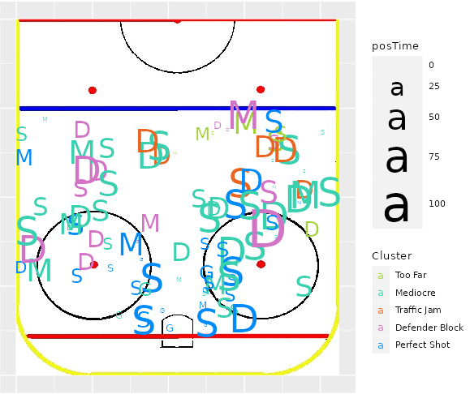
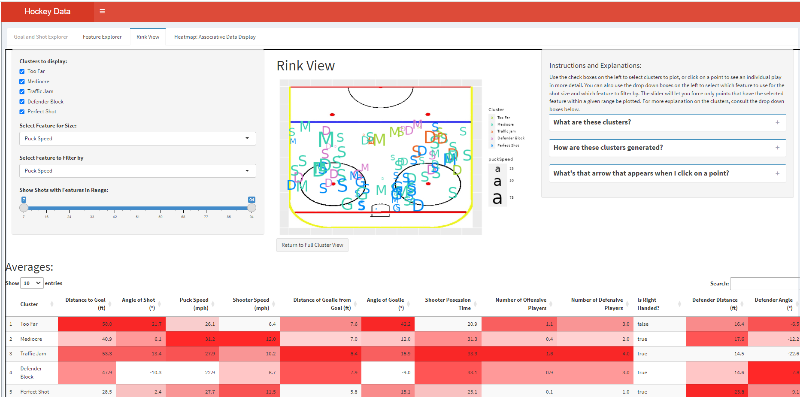
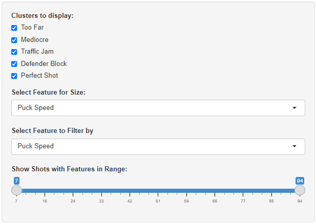
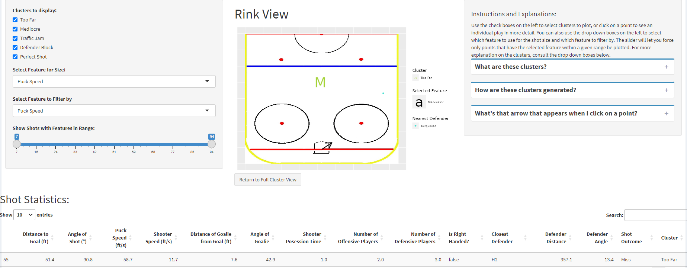
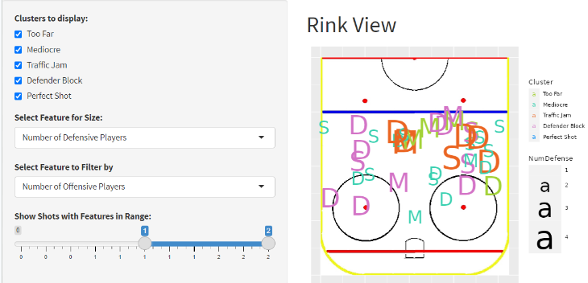

<!-- Replace 'title' with your title -->
<!-- Replace 'author' with your author list -->
<!-- Replace 'date' with with the current date -->

<!-- For R Markdown help see: http://bit.ly/RMarkdownCheatSheet -->
<!-- For R Notebook specific help see: http://bit.ly/2uNDpfA -->

<!-- Copy this notebook template to your working directory and customize -->

# DAR Project and Group Members

* Project name: Hockey Analytics
* Project team members: Caleb Smith, Amy Enyenihi, Ashley Woodson, Lieben Zhang, Jeff Jung

<!-- The `include=FALSE` option prevents your code from being shown at all -->
```{r, include=FALSE}
# This code will install required packages if they are not already installed
# ALWAYS INSTALL YOUR PACKAGES LIKE THIS!

if (!require("viridis")) {
   install.packages("viridis")
   library(viridis)
}

if (!require("ggplot2")) {
   install.packages("ggplot2")
   library(ggplot2)
}
if (!require("tidyverse")) {
   install.packages("tidyverse")
   library(tidyverse)
}
if (!require("knitr")) {
   install.packages("knitr")
   library(knitr)
}
if (!require("mltools")) {
   install.packages("mltools")
   library(knitr)
}
if (!require("umap")) {
   install.packages("umap")
   library(umap)
}
if (!require("data.table")) {
   install.packages("data.table")
   library(data.table)
}
if (!require("gplots")) {
   install.packages("gplots")
   library(gplots)
}
if (!require("kableExtra")) {
   install.packages("kableExtra")
   library(kableExtra)
}
if(!require(tidyverse)){
  install.packages("tidyverse")
  library(tidyverse)
}
if(!require(tidymodels)){
  install.packages("tidymodels")
  library(tidymodels)
}
if(!require(xgboost)){
  install.packages(xgboost)
  library(xgboost)
}
if(!require(pROC)){
  install.packages(pROC)
  library(pROC)
}
if(!require("DT")){
  install.packages(DT)
  library(DT)
}
library(caret)
## Repeat as needed for your required packages
#if (!require("example")) {
#   install.packages("example")
#   library(example)
#

```

# Abstract

The primary goal of the project was to provide the RPI Women's hockey team with actionable insights based on data captured about shots on a goal. This was achieved by using a gradient boosted decision tree to analyze feature importance as well as clustering to type shots. Clustering was achieved by first applying UMAP to the data set, followed by applying K-means to the projected data. I found that the most important factors in whether a shot was a goal was the distance to the goal, the possession time, the angle of the goalie relative to the shooter, and the number of players. To allow the team to get further insight from the data using their domain expertise, I developed an interactive R Shiny app that plots plays on the rink and allows the user to subset the data.


# Introduction and Background


The primary goal of this project was to provide useful insights to the RPI Women's hockey team. There is relatively little (public) data analytics going on within college hockey beyond basic statistics for players and teams, so we had relatively little to work with from previous work. We were very fortunate to have access the the work of the summer URP team, who placed a camera on the President's box at the Houston Field House to capture footage of the game. Due to limitations in capture footage (and for simplicity) the data we were provided is primarily for the RPI side of the rink, so we focused primarily on determining how the team could get scored on less. Hopefully, we can use this data to provide insights on how they could score more goals and get scored on less, thereby winning more games.


# Problems Tackled
 

The primary goal of the analysis was to determine different modes of failure for a shot on a goal. This was the initial goal of the project, which lead to the secondary goal of how to best present our findings to the hockey team in a way that would allow them to understand it, apply the results, and make further findings that we might not be able to see because of our lack of domain knowledge.

The rest of the report is organized roughly according to the provided template. Data description provides a description of what each feature actually means, including units. Data Analytics Methods goes over the feature selection and clustering methods I used to generate the results, while Experimental Results contains the figures and tables generated by that work, as well as the app I created to help with visualization. Finally, discussion of results indicates what information I noticed in the tables and graphs from Experimental Results, including recommendations for the hockey team. The conclusion contains the most important takeaway for the hockey team as well as suggestions for others who may work on this project in the future.


# Data Description

Data was sourced from the aforementioned camera on the President's box, and processed with the help of Dr. Morgan and the summer URP group. Since the camera is on RPI's side of the rink, the shots in the data frame are made by other teams at RPI's goal. While one of the three periods the away team was playing, those plays are not included in the data frame so that the analysis can focus on RPI's defense without worrying about difference between defending teams. The URP team prepared a data frame for the shots consisting of 105 shots on goal. Note all shots are from opposing teams at RPI.

*An RDS of the data file can be found at https://github.rpi.edu/DataINCITE/Hockey_Fall_2023/blob/dar-smithc22/StudentData/shots_stats_goal.df.Rds*

<!-- This section might have MANY code blocks, interspersed with discussion! -->
```{r }
# Code 
shots_stats.df <- readRDS("~/Hockey_Fall_2023/StudentData/shots_stats_goal.df.Rds")

shots_stats.df$defAngleDiff <- abs(shots_stats.df$defAngle - shots_stats.df$puckAngle)
shots_stats.df$goalieAngleDiff <- abs(shots_stats.df$goalieAngle - shots_stats.df$puckAngle)

head(shots_stats.df)
```
The following are the continuous variables of the dataset:

* puckDist represents the distance of the puck from the goal at the time the shot was taken, in tenths of a foot. Since the shooter has to be able to reach the puck with their stick to shoot it, it is also a good approximation of the shooter's distance from the goal

* puckAngle represents the angle in degrees of the puck (and by extension the shooter) from the goalie's left

* puckSpeed is the speed of the puck immediately after the shot, measured in feet per second

* shooterSpeed is the speed the shooter is skating at, in feet per second, at the time of the shot

* goalieDist is the distance of the goalie from the center of the goal, measured in tenths of a foot

* goalieAngle is the angle of the goalie from the goal, with 0 being the left.

* posTime is the amount of time the shooter has the puck before taking the shot, measured in seconds

* defDist is the distance from the shooter to the nearest defender, in tenths of a foot

* defAngle is the angle of the shooter from the left wall

* defAngleDiff is the unsigned angle between the nearest defender and the shooter, as measured in degrees.

* goalieAngleDiff is the unsigned difference between the angle of the goalie and the shooter in degrees

The following are the categorical variables:

* NumOffense is the number of players on the offensive team - that is, the same side as the shooter.  

* NumDefense is the number of players on the defensive team - that is, the same side as the shooter. 

* rightHanded is a binary variable that is 0 if the shooter is left handed, and 1 if the shooter is right handed

* closestDef is the tag of the closests defender to the shooter. It isn't used in the analysis, although note that GH indicates the goalie

* shotOutcome, rather obviously is the outcome of the shot. There are four options - Save, which indicates the shot was blocked by the goalie, Miss, which indicated that the puck wasn't intercepted by any players and didn't go in the goal, Defender Block, which indicates the puck was stopped by a player other then the goalie (note this could be either a defender intercepting it or an attacker accidentially blocking it), and Goal which indicates a goal.

Defender distance and defender angle were late additions to the dataset, and weren't present in the original feature importance analysis

For the clustering, scaling and one hot encoding was used to ensure even treatment of features.

```{r}
drop <- c('closestDef','shotOutcome')
shots <- shots_stats.df[,!(names(shots_stats.df) %in% drop)]
shotsNum <- shots
#One-hot encoding and making sure goals are dropped
shotsNum$NumOffense = as.factor(shotsNum$NumDefense)
shotsNum$NumOffense = as.factor(shotsNum$NumOffense)
shotsNum <- one_hot(dt = as.data.table(shotsNum))
shotsNum <- scale(shotsNum)
```

```{r,echo=FALSE}
custom.config <- umap.defaults
custom.config$random_state <- 2392023
set.seed(100)

select <- dplyr::select
```
 

\textbf{Feature Descriptions}

\begin{tabular}{c|c|c|c}
\hline
    Column Name & Data Type & Unit & Original or Derived \\
    \hline
     puckDist & Numerical & 0.1 ft & Original   \\
     puckAngle & Numerical & Degrees & Original \\
     puckSpeed & Numerical & ft/s & Original \\
     shooterSpeed & Numerical & ft/s & Original \\
     goalieSpeed & Numerical & ft/s & Original \\
     goalieDist & Numerical & 0.1 ft & Original   \\
     goalieAngle & Numerical & Degrees & Original \\
     posTime & Integer & Frames (at 30 FPS) & Original\\
     NumOffense & Categorical & Person & Original\\
     NumDefense & Categorical & Person & Original\\
     rightHanded & Boolean & N/A & Original\\
     closestDef & Categorical & N/A & Original\\
     defDist & Numerical & 0.1 ft & Original   \\
     defAngle & Numerical & Degrees & Original \\
     shotOutcome & Categorical & N/A & Original \\
     defAngleDiff & Numerical & Degrees & Derived\\
     goalieAngleDiff & Numerical & Degrees & Derived
     
\end{tabular}

*A summary table of the dataset. Most of the variables are numerical.*


# Data Analytics Methods

Two primary methods were used for the data analytics: feature selection with XGBoost and clustering with UMAP and K-means. XGBoost was chosen for feature selection as it had a higher balanced accuracy in classifying shots as goals than random forest and logistic regression models. Relative importance was used, which measures how important a given feature was in generating the tree compared to other features. 

Originally K-means was just applied to the data set, and failed to find clear clusters. PCA also failed to reduce the dimensionality enough to create obvious clusters for K-means to analyze. As a result, we hypothesized that the relations between features were non-linear, and decided to use UMAP to reduce the number of dimensions instead. This generated well separated clusters that were much easier for K-means to handle. When these clusters were compared with other clustering methods such as hierarchical clustering (See Ashley's paper for more information), they were found to be well founded in reality.

## Feature Selection

Initially to determine feature importance, a variety of machine learning classification models were used. The primary model used was a gradient boosted decision tree using the R package XGBoost. The only user specified parameter was the objective function. For that, I used "binary:logistic" since the logistic regression on its own did a pretty good job of classification. The other user parameter was the number of training rounds, which I chose 9 for to provide a good balance of improving the model without training for too many rounds and potentially overfitting.


<!-- This section might have MANY code blocks, interspersed with discussion! -->

To train the model, an 80/20 split was used between training data and testing data to provide a way to evaluate the accuracy of the model. A set seed of 100 was used with initial_split function to generate this split. While the model itself wouldn't be used for predicting actual data, understanding how accurately it reflected the actual data allowed us to determine how accurate the feature selection would be.

```{r,show=FALSE}
# Code 
#Create training set
set.seed(100)

#Performs the split
shotsNum <- cbind.data.frame(shotsNum,shots_stats.df$shotOutcome)

hockey_split <- initial_split(shotsNum, prop = 0.8)
hockeyTrain <- training(hockey_split)
hockeyTest <- testing(hockey_split)

shotsNum <- shotsNum[,1:17]

# Check how many observations for each split we have
print(paste(nrow(hockeyTrain)," rows in the training data" ))
print(paste(nrow(hockeyTest), "rows in the testing data"))
```

The model was trained on the training set using the aforementioned parameters.

```{r}
#Formats the data so the model can use it
labels <- ifelse(hockeyTrain[,18] == 'Goal', TRUE, FALSE)
testlabels <- ifelse(hockeyTest[,18] == 'Goal', TRUE, FALSE)

hockeyTrain <- hockeyTrain[,1:17]
hockeyTest <- hockeyTest[,1:17]

hockeyTestX <- data.matrix(hockeyTest)
hockeyTrainX <- data.matrix(hockeyTrain)


hockeyTrainXGB <- xgb.DMatrix(data = hockeyTrainX, label = labels)
hockeyTestXGB <- xgb.DMatrix(data = hockeyTestX, label = testlabels)

#Trains the data
xgbModel <- xgboost(data = hockeyTrainXGB,nround = 9,objective = "binary:logistic")
```

After this, it was evaluated on the testing data to determine accuracy, using R's pROC library to generate receiver operator curves, which will be displayed in the Results section.


Our next goal after analyzing what features were important was to identify some of the relations between features. Due to the lack of goals, it was difficult to get much insight from the features correlated with goals. Because of this we decided to focus on modes of failures - features that were correlated with each other, which we could get through clustering, and then checking the amount of goals in the cluster to determine if it was a mode of failure. 

## Clustering

UMAP uses nearest neighbor clustering to generate a non linear projection of higher dimensional data down to 2D. This makes it very useful for clustering, as it allows us to visually plot the clusters. In addition to a set seed of 100, a random state of 2392023 was used as a parameter for the UMAP. The R package for UMAP has issues with reproducibility when running the code interactively even with a set seed, so to replicate the results I recommend knitting a notebook to run any UMAP related code. If necessary, the projection can be stored in an RDS for future use. K means was used on the projection provided by UMAP to determine the final clusters. Using the UMAP plot in 2D space as well as the elbow test, I determined that 5 was a reasonable amount of clusters (see appendix for plots). Other team members using different clustering methods also reported a similar number of clusters.


```{r,echo=FALSE}
umapLabels <-  ifelse(shots_stats.df$shotOutcome == 'Goal', TRUE, FALSE)

aUmap <- umap(shotsNum,n_components = 2,config = custom.config)
k <- kmeans(aUmap$layout,5)
```

# Experimental Results

<!-- This section might have MANY code blocks, interspersed with discussion! -->

Results can be examined in three parts: General results of the feature selection, results of the clustering, and integration of results into an RShiny app. Balanced accuracy and a confusion matrix were examined to determine that the model reflected the data, and therefore that the results of feature selection were accurate, followed by a discussion of the features with the highest relevant importance. Clusters are investigated by a heatmap and observing the cluster means in the pre-projection data. Finally, the app was used to visualize the clusters and allow further investigation, an example of which will be shown in "Discussion of Results and Key Findings."

## Model Results and Feature Selection

Confusion Matrix of Model:
```{r,echo = FALSE}
testXGB <- predict(xgbModel,hockeyTestXGB,type = 'prob' )


debug <- testXGB > 0.20


cmXGB <- as.matrix(table(Actual = testlabels, Predicted = debug))
kable(cmXGB)
balAccXGB <- (cmXGB[1,1]/(cmXGB[1,1]+cmXGB[1,2]) + cmXGB[2,2]/(cmXGB[2,1]+cmXGB[2,2]))/2
print(paste("The balanced accuracy was: ",balAccXGB))

```
*Y axis shows predictions, the X axis the actual values*

The balanced accuracy, while a bit low, was acceptable given the sample size. Due to the lack of goals in the training data, the model had to be rather sensitive to get a good balanced accuracy. The threshold probability for a shot being predicted as a goal was 20% in this case. Because of the balanced accuracy, we can be reasonably confident that the results from feature selection are an accurate representation of reality

```{r, include=FALSE}

rocData <- data.frame("Class" = testlabels, "XGB" = testXGB)
rocList <- roc(Class ~ .,data=rocData)
XGBauc <- round(auc(Class ~ XGB, data = rocData), digits = 3)
```

```{r,echo=FALSE}
ggroc(rocList)+
  ggtitle(
    "Reciever Operator Curve")+
  theme_classic()
print(paste0("The area under the curve (AUC) is ",XGBauc) )
```

*A reasonable sensitivity can only be achieved by significantly reducing the model's specificity. The AUC is decent enough that the model can be trusted.*

\textbf{What Features Determine a Goal?}

```{r,echo=FALSE}
# Code 
impXGB <-xgb.importance(model = xgbModel)
xgb.plot.importance(impXGB, rel_to_first = TRUE,xlab = "Relative Performance") 
```

*Barplot of the importance of each feature in the XGBoost model, scaled so the most important feature has a value of 1*

The distance of the puck from the goal at the time of the shot was one of the most important determiner of whether a shot was a goal. Intuition, the clustering results that will be discussed shortly, and visualizations on the rink all suggest that closer is better when it comes to scoring goals. The difference in angle between the shooter and the goalie was also rather important, since the goalie needs to be in position to block the shot. As will be seen with the clusters later, when there is a major difference between the location of the goalie and where the puck will enter the goal, the shot is much more likely to succeed.

\textbf{Possession Time and Shot Success}

```{r,echo=FALSE, out.width="500px"}

```

*Look out how small all the goals are*

Last but certainly not least among the top three features, possession time was an important determiner of success. While the clustering doesn't provide conclusive results on which possession time is best, as other factors have a greater impact in separating the shots into clusters, using the Rink View to filter out shots based on possession time shows that all goals had a possession time of less than eighteen frames. This can also be seen extremely easily by setting the size of shots based on their possession

## Cluster Results

The results of the clusters from UMAP:

```{r,echo=FALSE}
shotsNumRegular <- as.data.frame(scale(apply(shots,2,as.numeric)))
preimageCenters <- shotsNumRegular%>% group_by(as.factor(k$cluster) ) %>% summarise_all(.funs =  mean)
heatmapData <- as.matrix(preimageCenters[,2:ncol(preimageCenters)])
heatmap.2(heatmapData,
          main = "Cluster Centers",
          scale = "none",
          trace = "none",
          dendrogram = "none",
          Colv = TRUE,
          Rowv = TRUE,
          margins = c(8,16))
```


*A heatmap of the mean values of each cluster. Factors that are more different between the clusters appear further to the right*

\textbf{Cluster Means}

```{r,include=FALSE}
sumTab <- shots
sumTab$wasDB <- ifelse(shots_stats.df$shotOutcome == "Defender Block",1,0)
sumTab$wasMiss <- ifelse(shots_stats.df$shotOutcome == "Miss",1,0)
sumTab$wasSuccess <- ifelse(shots_stats.df$shotOutcome == "Goal",1,0)
sumTab$wasSave <- ifelse(shots_stats.df$shotOutcome == "Save",1,0)


summaryTable <- sumTab%>% group_by(as.factor(k$cluster) ) %>% summarise_all(.funs =  mean)

#colnames(summaryTable)

kbl(summaryTable[,1:4],booktabs = T) %>% kable_styling(latex_options = c("striped","scaled_down"),full_width = F,position = "left")
kbl(summaryTable[,5:10],booktabs = T) %>% kable_styling(latex_options = c("striped","scaled_down"),full_width = F,position = "left")
kbl(summaryTable[,11:ncol(summaryTable)],booktabs = T) %>% kable_styling(latex_options = c("striped","scaled_down"),full_width = F,position = "left")
```

```{r,echo=FALSE}
shotsWClusters <- readRDS("~/Hockey_Fall_2023/StudentData/shots_stats_goal_clusters2.df.Rds")
toSum <- cbind.data.frame(shotsWClusters[,'Cluster'],shotsWClusters[,1:10],shotsWClusters[,12:13],shots_stats.df[,16])
      #Renames all the columns so it isn't hideous
      names <-c('Cluster','Distance to Goal (ft)','Angle of Shot (°)','Puck Speed (mph)','Shooter Speed (mph)','Distance of Goalie from Goal (ft)',
                'Angle of Goalie (°)','Shooter Posession Time','Number of Offensive Players',
                'Number of Defensive Players','Is Right Handed?',
                'Defender Distance (ft)','Defender Angle (°)','Goalie-Shooter Angle Difference (°)')
      colnames(toSum) <- names
      toSum <-cbind.data.frame(toSum[,1] ,apply(toSum[,setdiff(names,c('Cluster'))],2,as.numeric))
      colnames(toSum) <- names
      #print(toSum)
      toSum$Cluster <- as.factor(toSum$Cluster)
      #Grouping by cluster
      levels(toSum$Cluster) <- c("Too Far","Mediocre","Traffic Jam","Defender Block","Perfect Shot")
      
            toSum$wasDB <- ifelse(shots_stats.df$shotOutcome == "Defender Block",1,0)
toSum$wasMiss <- ifelse(shots_stats.df$shotOutcome == "Miss",1,0)
toSum$wasSuccess <- ifelse(shots_stats.df$shotOutcome == "Goal",1,0)
toSum$wasSave <- ifelse(shots_stats.df$shotOutcome == "Save",1,0)
      
      tab <- as.data.frame(toSum) %>% group_by(Cluster) %>% summarise_all(.funs = mean)
      
      
      #Converting everything to the right units
      tab[,"Distance to Goal (ft)"] <- tab[,"Distance to Goal (ft)"]/10
      tab[,"Distance of Goalie from Goal (ft)"] <- tab[,"Distance of Goalie from Goal (ft)"]/10
      tab[,"Is Right Handed?"] <- lapply(tab[,"Is Right Handed?"], as.logical)
      tab[,"Puck Speed (mph)"] <- tab[,"Puck Speed (mph)"]/1.467
      tab[,'Shooter Speed (mph)'] <- tab[,'Shooter Speed (mph)']/1.467
      tab[,'Angle of Goalie (°)'] <--1 *  (tab[,'Angle of Goalie (°)'] - 90) #currently positive is left, do I need to multiply by -1 to flip this?
      tab[,'Angle of Shot (°)'] <--1 *  (tab[,'Angle of Shot (°)'] - 90)
      tab[,'Defender Distance (ft)'] <- tab[,'Defender Distance (ft)']/10
      tab[,'Defender Angle (°)'] <- -1 *  (tab[,'Defender Angle (°)'] - 90)
      

      
      summaryTable <- tab
```


```{r,echo=FALSE}
      kbl(summaryTable[,1:5],booktabs = T) %>% kable_styling(latex_options = c("striped","scaled_down"),full_width = F,position = "left")
kbl(summaryTable[,6:9],booktabs = T) %>% kable_styling(latex_options = c("striped","scaled_down"),full_width = F,position = "left")
kbl(summaryTable[,10:13],booktabs = T) %>% kable_styling(latex_options = c("striped","scaled_down"),full_width = F,position = "left")
kbl(summaryTable[,14:ncol(summaryTable)],booktabs = T) %>% kable_styling(latex_options = c("striped","scaled_down"),full_width = F,position = "left")
```

*A table providing the numerical values of each cluster center*


The 5th cluster, "Perfect Shot", stands out for the highest success rate at 20%. The notable difference between shots in this cluster and shots in the other clusters is the distance involved. The average distance to goal is 12 feet closer than the next closest cluster, and almost 30 feet closer than the furthest cluster. They also tended to not have any players other than the goalie involved who could potentially block the shot. The goalie tended to be off the line the puck was travelling on by about 35 degrees, so the fact she was still able to block over half the shots is pretty astounding.

3 of the clusters are a different mode of failure. For example, the third cluster is characterized by a large number of other players involved in the shot. This results in the high number of defender blocks (over 70%). This cluster also had the highest number of offensive players, so it seems that they were unsuccessful in assisting the shooter, as barely any of these shots even made it to the goal. For this reason, I decided to name the cluster "Traffic Jam" for future reference, as there are too much traffic on the ice for a shot to reach the goal.

The fourth cluster, "Defender Block", also had a similar problem with being blocked by the defenders. While there were less people in a position where they could block the shot, there were still defenders nearby and able to get in the way. However, due to the reduced number of players involved, these shots had a slim chance at success.

Another such mode of failure was shots made from too far away, as seen in in the first cluster, "Too Far". While the goalie was out of position (as can be seen by shooter-goalie angle difference) and the shooter managed to avoid any other players getting in the way, they shot from too far away, resulting in a significant portion of the shots missing the goal altogether. The goalie was able to intercept the shots that did reach the goal, as shooting from further away increases the travel time and gives the goalie more time to react. This aligns with the importance of distance in the feature selection.

The second cluster is composed of pretty "mediocre" shots, although although they tended to be faster than average. This cluster reveals that speed is no substitute for positioning, as it is very similar to cluster 5, which contains most of the goals, except for the distance to the goal and the shooter-goalie angle difference. These shots were about 12 feet further away, which probably contributed to the higher-than-average miss rate. They also tended to have the goalie only slightly out of position (by 12 degrees), allowing the goalie to block the puck the majority of the time.

Finally, to confirm the analysis results and also allow further insights into the data to be made by others, I created an app called Rink View to visualize the results.

## App

\textbf{The RinkView App}

```{r,echo=FALSE, out.width="500px"}

```


The primary section of the app is a rink view, where plays are colored by which cluster they are in. This provides a much more intuitive way to understand the clusters than the heatmap or table provides. Shots are plotted as a letter on the rink, with G being a goal, M being a miss, D being a defender block, and S being a goalie save. The graph can be impacted by using the sidebar to filter based on a feature range and selecting or deselecting clusters, as well as by clicking an individual point on the graph. At the bottom of the screen is a summary table similar to the one shown earlier in the paper displaying the mean values for each of the cluster centers. This table dynamically updates along with the graph with the filtering, which is useful for observing correlated features.

\textbf{Sidebar}

```{r,echo=FALSE,out.width="500px"}

```

*The sidebar allows the user to filter the data*

Clicking on a letter on the rink plot will change the graph to focus on just that shot. All other shots will be removed from the graph, and additional information will be displayed about the shot. A turquoise dot is added to show the location of the nearest defender, and an arrow is added pointing to the location of the goalie at the time the shot was taken. Additionally, the summary table at the bottom changes to the exact statistics for the play

\textbf{Single Shot}

```{r,echo=FALSE,out.width="500px"}

```

*An example of an individual play - The shot was clear, but they were too far away to make it*


# Discussion of Results and Key Findings


The most major finding was the importance of distance in the success of a shot, which could be seen in both the feature selection and in the clusterings. The furthest shot that was a goal was about 29 feet away, with most of the goals being closer. 

<!-- This section might have MANY code blocks, interspersed with discussion! -->

```{r }
# Code 
goals <- shots_stats.df %>% filter(shotOutcome == 'Goal')
max(goals$puckDist)/10
```

The feature selection indicated that distance was one of the most important features, and the cluster with the majority of the goals was also much closer to the goal than the other clusters. This can also be seen visually in the Rink View, where all of the G's are in or slightly beyond the red dots in the center of the circles. While it is rather obvious that being closer to the goal makes it easier to shoot into the goal, it is much more important than the average shooters appears to think.

\textbf{Possession Time and Shot Success}

```{r,echo=FALSE, out.width="500px"}

```

*Look out how small all the goals are*

Shooter-goalie angle and the possession time were the other major findings from the feature selection. Goals tended to have low possession times and a high angle difference. This is likely due to a pass made immediately before the shot was taken place. According to Nina, a common strategy is for two offensive players to approach the goal together, and pass right before the shot is made. A high angle difference and low possession time are consistent with this strategy, so it is likely an effective offensive strategy. Therefore, since so many goals come from it, efforts should be made to counter this strategy by the defense.

While the feature selection doesn't indicate the importance of the number of players involved, it does show up in the clustering. The cluster that contains most of the goals was also the one with the fewest players on either team. Once again, the Rink View can be used to visually confirm this. Selecting the number of defensive players for the size scale causes a point to disappear if the number of defenders is one, indicating that the goalie is the sole defender. When this option is selected, half of the goals disappear. Perhaps even more striking is the impact on filtering by number of offensive players. Using the slider to filter so that only shots with one or more offensive player who isn't the shooter is involved causes all goals to disappear, with mostly just Traffic Jam plays remaining. This is partially due to the fact that these shots tend to have a higher distance from the goal than other shots, but still indicates the importance of making sure that the shooter's teammates need to make sure they aren't in the way of the shot for a success to occur. 

\

\

\

\


\textbf{Filtering goals by players involved}

```{r,echo=FALSE, out.width="500px"}

```

*The combination of size and filtering has removed all the goals*


# Conclusions

The most obvious recommendation that was already covered in results is for the hockey team to reconsider what distance they shoot from. As I am not a hockey expert, I am unable to determine how many of the far out shots were designed to set up a rebound, but the quantity of shots taken from far out compared with the amount that score indicate that shooting the puck at the first available opportunity isn't effective. Additionally, although the hockey team likely already knows this, the shots most likely to score are made immediately after receiving the puck. Most of the conclusions about the applications of the results must be made by the hockey team, as they have the subject matter expertise to determine why particular things cause shots to fail and how to play in such a way as to maximize the failures of other team's plays while minimizing their own failures. For example, they could make better clusters by eye by associating the shot statistics with certain types of plays, and use that to inform their own choice of plays and how to set up their defense to counter.

# Directions for Future Investigation

The most important recommendation I can make is that this project be continued with the collection of more data. The lack of goals makes it rather difficult to determine what causes a shot to be a goal, and forces anyone who works on the project to look at what prevents a shot from becoming a goal instead. While the skill level of our goalie means increasing the number of goals in the sample size is rather difficult, with enough games recorded it will eventually grow to a decent size. As mentioned in conclusions, we have reached a point where greater involvement of the hockey team in the analytics process is vital for turning data into wins.

App development should be continued for the hockey team, to assist them in taking over the analysis. Our current app isn't as polished as we would like and has plenty of room for more and more useful features. For example, the Federal Reserve Economic Data (FRED) has a way to add your own derived features to a plot based off of existing features. The shooter-goalie angle difference was a late addition to the dataset, but provided valuable information, so allowing the user to easily derive other features that could be useful is important.

# Bibliography

* Citations from literature.

N/A

* Significant R packages used

Made possible by the following R packages:

* `ggplot2`
* `tidyverse`
* `knitr`
* `mltools`
* `umap`
* `data.table`
* `gplots`
* `tidymodels`
* `xgboost`
* `pROC`
* `DT`


# Files and Github Commits
Commit your final files and any supporting files to github. List your files and their locations here and explain purpose of each one.   Make sure to include all files necessary to reproduce your results.  

File: app.R
Location: https://github.rpi.edu/DataINCITE/Hockey_Fall_2023/blob/main/ShinyApps/HockeyDashboard/app.R
Purpose: The source code for the R Shiny visualization app I mentioned in the paper. My app is under Rink View, but you can also view apps made by other members of the team.

File: shots_stats_goal.df.Rds
Location: https://github.rpi.edu/DataINCITE/Hockey_Fall_2023/raw/dar-smithc22/StudentData/shots_stats_goal.df.Rds
Purpose: Primary data source used

File: shots_stats_goal_clusters2.df.Rds
Location: https://github.rpi.edu/DataINCITE/Hockey_Fall_2023/raw/dar-smithc22/StudentData/shots_stats_goal_clusters2.df.Rds
Purpose: The primary data with added labels for which cluster a shot belongs to

File: dar_final_smithc22_14122023.Rmd
Location: https://github.rpi.edu/DataINCITE/Hockey_Fall_2023/blob/dar-smithc22/StudentNotebooks/FinalReport/dar_final_smithc22_14122023.Rmd
Purpose: This notebook!

# Contribution
If this is joint work, then discuss the contribution of each teammate. 

The Rink View part of the Hockey Data app is all my own work. The other tabs are made by other members of the group - Ashley did the heatmap, Amy did the rink plots by outcome, and Lieben did the Feature Explorer.

# Appendix


```{r,echo=FALSE}
outcome <- as.factor(shots_stats.df$shotOutcome)

ggplot()+
  geom_point(data = as.data.frame(aUmap$layout),aes(x = V1,y = V2,shape = outcome)) +
  scale_shape_manual(values = c(25,8,22,15,11))+
  ggtitle("How many clusters are there?")
```

*A plot of the data projected into 2D space by UMAP. There appears to be four clusters, but K-Means grouped the bottom two clusters together when I tried to do four clusters*

```{r,echo = FALSE}
Cluster <- as.factor(k$cluster)

ggplot()+
  geom_point(data = as.data.frame(aUmap$layout),aes(x = V1,y = V2,shape = outcome,color = Cluster)) +
  scale_shape_manual(values = c(25,8,22,15,11))+
  ggtitle("How good is the clustering??")
```

*The decision to split the top left into two seperate clusters was unusual, but the alternative was lumping the bottom two together. Note that clusters 3,4, and 1 are rather similar to each other, because they are all too far away.*
