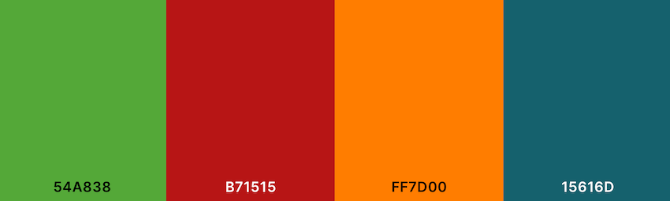
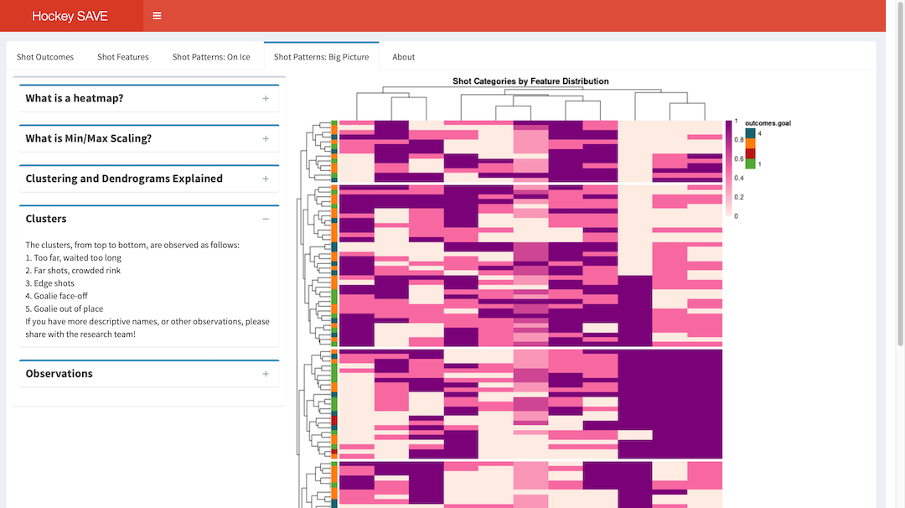

# DAR Project and Group Members

* Project name: Hockey Analytics 
* Project team members: Amy Enyenihi, Jeff Jung, Caleb Smith, Liebin Zhang
* Github branch: dar-woodsa4

Required packages will be installed and loaded as necessary (code suppressed) if the notebook is run. 

```{r, include=FALSE}
# This code will install required packages if they are not already installed
# Specify repository
r = getOption("repos")
r["CRAN"] = "http://cran.rstudio.com"
options(repos = r)

if (!require("png")) {
   install.packages("png")
   library(png)
}
if (!require("shiny")) {
   install.packages("shiny")
   library(shiny)
}
if (!require("pheatmap")) {
   install.packages("pheatmap")
   library(pheatmap)
}
if (!require("shinydashboard")) {
   install.packages("shinydashboard")
   library(shinydashboard)
}
if (!require("tidyverse")) {
   install.packages("tidyverse")
}
if (!require("knitr")) {
   install.packages("knitr")
   library(knitr)
}
```

# Abstract
This project's purpose is to analyze data gleaned from motion capture images of RPI Women's Ice Hockey games. The use of heatmap visualization results in clusters, which are supported through the analysis methods performed by other group members. This analysis has found that puck speed, number of players involved in the play, and goalie positioning have the highest relevance to defensive success or failure. This visual was placed in the Hockey SAVE App, which enables users to view developed analysis tools and draw conclusions. 

# Introduction and Background

Our team's investigation into the motion capture data serves as a continuation of the work of the previous research team, who developed and applied the model which analyzed the video images to create our initial data set. Our aim is to evaluate these provided features: Number of offensive and defensive players, the puck speed, distance and angle, the goalie distance and angle, as well as the handedness, speed and possession time of the shooter. We want to be able to provide this analysis in a format hockey players and coaches can use to both gain insight through provided conclusions, as well as explore the data to draw their own conclusions. This is achieved through the Hockey SAVE app described in the Communication of Results section, and linked in the Files section.

# Problems Tackled

The problem focused on in this research is to identify what feature or features has the greatest impact on goal outcome. In essence, what factors prevent goals?

The organization of analysis below aims to answer this question by introducing the data and processing the dataset. Then, the heatmap is created and analyzed. Throughout the semester many different graphing techniques were attempted, finding the method presented below to be the most successful. Conclusions, application, and next steps follow. 

# Data Description/Preparation

The source of the dataset is Jeff's categorized data, linked in the Files section. The original dataset contained more than 200 shots, but was reduced when we removed all shots where RPI was on offense, to make the goalie consistent. This provided more accurate analysis, by removing a confounding variable (different goalie). This left just 105 shots. The features originally had both continuous and categorical variables, including shooter speed, puck speed, puck angle, goalie angle, puck distance, possession time, distance of closest defender, and goalie distance, as continuous variables by nature; handedness, number of offensive players and number of defensive players are categorical by nature. Jeff then took the continuous variables, and categorized them by placing them into 3 categories, low medium and high, for each feature. This was done by percentile, such that each category has exactly 1/3 of the dataset (or exactly as possible as 105 does not divide perfectly by 3). 

When Jeff categorized the data, he left the continuous variables in the dataframe, so since they could not be included in the heatmap, I removed them from my dataframe. The categorical variables were chosen over the combination of continuous and categorical variables for consistency of analysis. The heatmaps continually took the data type (categorical or continuous) as the primary level of feature importance, which is not useful for this feature analysis. Since categorical variables like handedness cannot be made continuous, the use of all categorical variables was deemed optimal for equal weighting the variables.

The columns are min/max scaled, something which was decided upon through multiple analyses. It was clear that the min/max scaling resulted in the most readable and informative visualization, compared to other normalization methods. The conclusions drawn did not change, so the method was chosen for readability. Lastly, conversion to a matrix is necessary for the use of the pheatmap function later on.


```{r, echo=FALSE}
#Custom function minMax is to be mapped to each column for the purposes of scaling the data.
minMax <- function(x) {
  (x - min(x)) / (max(x) - min(x))
}
```

```{r, echo=TRUE}
#The data file is to be read in, have the excess features removed, have the 
#columns be min/max scaled, and converted to a matrix.
#read in the data file. This line assumes it has been placed StudentData,
#so you must access this folder to run this notebook
shots_cat.df <- read_rds("../../StudentData/categorized_shots_stats_goal.df.Rds")

#remove the continuous and outcome features
features <- subset(shots_cat.df, select = -puckDist)
features <- subset(features, select = -puckAngle)
features <- subset(features, select = -puckSpeed)
features <- subset(features, select = -shooterSpeed)
features <- subset(features, select = -goalieDist)
features <- subset(features, select = -posTime)
features <- subset(features, select = -goalieAngle)
features <- subset(features, select = -closestDef)
features <- subset(features, select = -defDist)
features <- subset(features, select = -defAngle)
features <- subset(features, select = -shotOutcome)
features <- subset(features, select = -outcomes.goal)

#make the goal line
goal <- subset(shots_cat.df , select = outcomes.goal)
goal$outcomes.goal <- as.numeric(goal$outcomes.goal)

#normalize data using custom function
pmmScale <- as.data.frame(lapply(features, minMax))

#convert to a matrix in order to input to heatmap function
pmmScale <- as.matrix(pmmScale, rownames.force = TRUE)

```

# Data Analytics Methods

The analysis method I chose was to utilize heatmaps. Throughout the semester I applied many different heatmap functions to both the continuous and discrete data, including heatmap2, heatmaply, and pheatmap. These use slightly different dendrogram algorithms, and thus produced slightly different graphs, but ultimately the same results once analyzed. As a result, the algorithm chosen was the one which created the most readable visualization. This was pheatmap. 

This was then employed with the min/max scaling to create the heatmap below:

```{r, echo=FALSE}
## Defender blocked, goal, goalie blocked, miss
resultColors <- list(outcomes.goal=c("#54a838", "#b71515", "#ff7d00", "#15616d"))

png("pheatmapMinMaxCat.png", height = 1000, width = 800)
pheatmap(pmmScale,
         scale = 'none',
         show_rownames = FALSE,
         main = "Shot Categories by Feature Distribution",
         col = colorRampPalette(c("#feebe2", "#f768a1", "#7a0177"))(75),
         cutree_rows = 5,
         fontsize_row = 1,
         annotation_row = goal,
         annotation_colors = resultColors,
         silent = TRUE
         )

knitr::include_graphics("pheatmapMinMaxCat.png")
```

# Discussion of Results and Key Findings

Analysis of the clusters above has resulted in the following names.
    
Cluster 1: Too far, waited too long

  * This cluster contains shots that were too far from the goal, and were also characterized by a high possession time. This may be the result of defenders successfully denying the shooter clear line-of-sight to the goal, forcing bad shots.
  
Cluster 2: Far shots, crowded rink
  
  * This cluster also contains far shots, but specifically with a crowded rink. Too many players, both offensive and defensive, appear to increase the odds of an interception before the puck reaches the goal. 
    
Cluster 3: Edge shots (some goals)
  
  * With this category, all the shots were taken from the highest angle category for both the puck and goalie. However, all the successful goals were from close in, as opposed to many of the non-goals being from a further distance. Within this cluster we see how, although the angle is what clusters them, distance is still the defining factor of success. It is possible that this type of shot is where players sneak around the back of the goal, and take a short flick into the corner.
    
Cluster 4: Goalie face-off
  
  * As it sounds, a well-aligned goalie is difficult to shoot around, resulting in a high proportion of saves for this cluster. 
    
Cluster 5: Goalie out of place (most goals)
  
  * When the goalie is not in the goal, or off to the opposite side of the shooter, then there is rarely someone to block the shot and most goals occur under this condition.
        
This is very significant because they line up very closely with the clusters developed by Caleb through his U-Map/k-means clustering. Caleb also found that shots that were at a high distance did not result in goals, similar to my first and second clusters. "Traffic Jam", another of Caleb's clusters, also identifies a similar mode of failure to my 2nd cluster where the rink was too crowded, and both offensive and defensive players hindered goals. My 5th cluster, "goalie out of place", also aligns well with Caleb's "Perfect Shot" cluster, as it identifies the most frequent cases of goal success; identifying cases where the goalie was not well-placed between the puck and goal, such that scoring was possible. This correlation increases confidence that these results are accurate. They also follow closely with the generally understood conventions of ice hockey, where when the goalie is not able to block the shot, being out of position, shots are likely to score. Long distance shots, too many players close to the goal, and a well-placed goalie are all known to cause difficulty in scoring. 

# Conclusions

Conclusions that can be drawn lie in the cluster groupings, where we can see that, as per the above analysis, puck distance is the primary factor in predicting goal success. For RPI's defense, keeping shooters at a high distance essentially guarantees that no goal will be scored. The next most significant factor is the number of players involved, meaning the more players, the more chaotic the rink becomes and the more interceptions occur. This is true whether the players involved are offensive or defensive - too many players reduce scores. Finally, goalie misplacement accounts for the biggest indication of defensive failure: a goal. Recommendations to make use of these results would be to provide our analysis to the hockey players through the Hockey SAVE app, so they can draw their own conclusions about the technical hockey causes of each of these scenarios, and how they can best adapt their game play to utilize this knowledge.

# Communication of Results: Hockey SAVE

To best communicate these results, directly to RPI's Women's hockey players, our team decided to develop a web app, such that our collective analysis could be tinkered with. For this app, I developed both my own page, as well as the overall dashboard template we used to integrate our apps. 

### Color Scheme

One of the most important steps, while developing our individual apps, was determining the color schemes that would carry between pages to maintain continuity. With the help of COMM-D here at RPI, we settled on the following colors to represent the four goal outcomes:

* Defender Blocked = green = 0x54A838

* Goal = red = 0xB71515

* Save (Goalie Blocked) = orange = 0xFF7D00

* Misses = blue = 0x15616D

This is demonstrated in the following figure:

```{r, echo=FALSE}
png("OutcomeColors.png", width = 800)

```

This was important for both the heatmap I developed, as the sidebar indicates which goal outcome occurs for each shot, and Liebin's graphs, as they also display data by outcome. We did attempt to develop color schemes which were colorblind friendly, however the number of differentiating colors we needed across the app would then not have been color-vision friendly, so we decided to cater to the majority of users. 

### Hockey SAVE

For my individual page, I included the heatmap (generated above), and many dropdown menus to allow both experienced and introductory exploration of my heatmap, depending on the user's needs. This fit into the overall dashboard template I created as a tabbed page, titled Shot Patterns: Big Picture. Each developed tool was placed into the Hockey SAVE: Shot Analysis Visualization Explorer as a separate page, navigable by the tabs at the top of the page. This was implemented using modularization, such that each group member had their own section of the UI to develop, as well as their own section of the server, which would then be called together to run the app. This greatly simplified the process of integration, as we simply passed ownership of the dashboard around, and only made changes to our own sections to avoid any conflicts. This resulted in the working application present at the link below in Files. My page specifically is also shown below in figure 3. 

```{r, echo=FALSE}

```

This is the default view when the tab is selected; the left-hand menus display information very similar to what is discussed in the data preparation and conclusion sections of this report. The page can be scrolled to view more of the content.

# Directions for Future Investigation

A good direction to move this project in would primarily include increasing data. We have only 105 shots-on-goal on RPI's goalie, so having more instances of this would help us to increase accuracy. With only one third per game on offense, we lack significant data there; the results of this analysis varied too much because of the different goalies. More instances of RPI on offense would allow us to answer questions like, "How can RPI increase scoring success?" As opposed to the defensive-only questions, like we have answered in our collective work of "How can RPI prevent opposing goals?"

Ongoing data capture will be necessary as well, since RPI is a college the roster changes every year, and completely every four years, such that new goalies, defenders, and other players with different strengths and weaknesses will be on the ice, and may garner different results and recommendations for their particular skill set.

Within the Hockey SAVE app, under my page, Shot Patterns: Big Picture, a dynamic heatmap, which can display various clusters by selection, or update depending on different datasets as future work is completed would also help improve the maintainability of the project.


# Bibliography

R packages most utilized for analysis and developement:

  pheatmap: https://www.rdocumentation.org/packages/pheatmap/versions/1.0.12/topics/pheatmap
  
  shinydashboard: https://rstudio.github.io/shinydashboard/structure.html#column-based-layout


# Files

Files referenced for reproducability:

* Jeff's Categorized Data
    * https://github.rpi.edu/DataINCITE/Hockey_Fall_2023/blob/main/StudentData/categorized_shots_stats_goal.df.Rds
    * This serves as the base input data, which could change in future implementations with additional motion-capture data from the new cameras and future games. 
    
* Hockey SAVE App
    * https://github.rpi.edu/DataINCITE/Hockey_Fall_2023/blob/main/ShinyApps/HockeyDashboard
    * Explained above in Communication, this links to the Hockey SAVE App where my heatmap is displayed.

* This notebook
    * https://github.rpi.edu/DataINCITE/Hockey_Fall_2023/tree/dar-woodsa4/StudentNotebooks/FinalReport/dar_final_woodsa4_15dec2023.pdf
    * https://github.rpi.edu/DataINCITE/Hockey_Fall_2023/tree/dar-woodsa4/StudentNotebooks/FinalReport/dar_final_woodsa4_15dec2023.Rmd
    * These are the pdf and R notebook respectively, where the pdf has been submitted to gradescope, and they are both on GitHub for easy access and reproducability.  
    * OutcomeColors.png and BigPicturesScreenshot.png also live in this directory at https://github.rpi.edu/DataINCITE/Hockey_Fall_2023/tree/dar-woodsa4/StudentNotebooks/FinalReport because they are necessary for running this notebook. 

